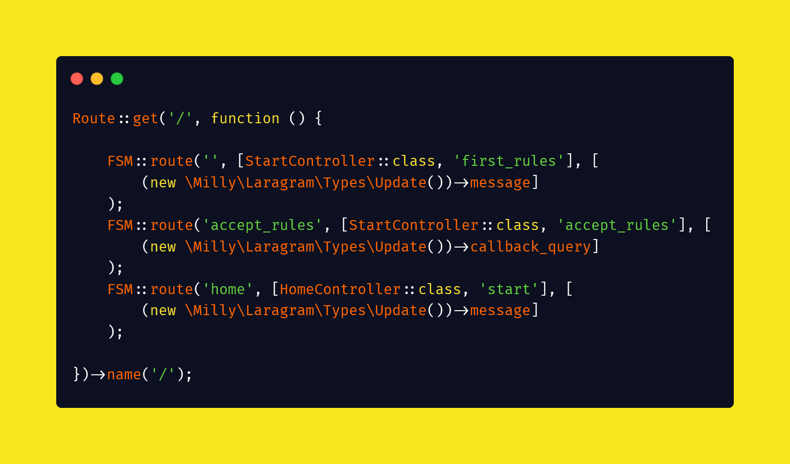
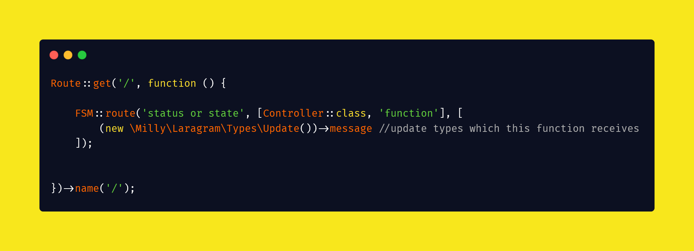

# Laragram - Laravel package to develop telegram bot inside laravel project

* ## First PHP telegram bot package which supports FSM-Routing

* ## All types are documented, so you can code easy with your ide

* ## Use it inside laravel project as a package, and you will be able to all utils
* route middleware
* multi-lang
* guards
* CLI
* migration
* and others and others

## Installation

<code>composer require milly/laragram</code>

## FSM-Routing:

## Using telegram bot api methods

That's all:) <a href="patreon.com/mirmuxsin">Buy me a coffee</a>