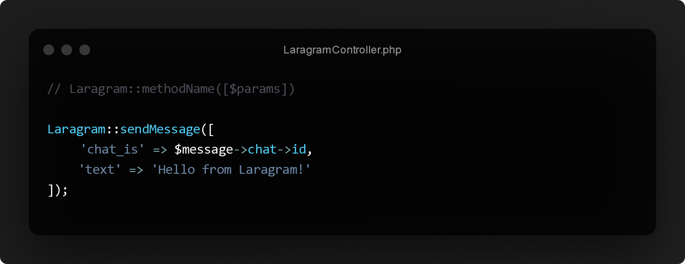

<h1 align='center'><samp>LARAGRAM</samp></h1>
<h3 align='center'><sup align='center'>Laravel package to develop telegram bot inside laravel project</sup></h3>
<p align='center'>
  <a href='https://github.com/Mirmuxsin/laragram/blob/master/license'></a>
  <a href='https://packagist.org/packages/milly/laragram'></a>
  <a href='https://www.patreon.com/millykhamroev'></a>
</p>

## Installation
> This package is required Laravel ^5.5 or newer

First, install Laragram package, and make sure that the database connection settings are correct!

```bash 
composer require milly/laragram
```

Then run these commands to publish assets and config

```bash
php artisan vendor:publish --provider="Milly\Laragram\LaragramServiceProvider"
```

After run command you can find config file in `config/laragram.php`. \
At last create `routes/laragram.php` and controller, \
and run this command to run application.

```bash
php artisan laragram:start
```

Sample:

```php
// routes/laragram.php

use App\Http\Controllers\LaragramController;
use Milly\Laragram\FSM\FSM;

FSM::route('', [LaragramController::class, 'start'], [
  (new \Milly\Laragram\Types\Update())->message
]);
```

```php
// LaragramController.php

namespace App\Http\LaragramController;

use Milly\Laragram\Laragram;
use Milly\Laragram\Types\Message;

class HomeController extends Controller
{
    public static function start(Message $message)
    {
        $chat_id = $message->from->id;

        return Laragram::sendMessage([
            'chat_id' => $chat_id,
            'text' => 'Hello from laragram!'
        ]);
    }
}
```

---

## Features

### First PHP telegram bot package which supports FSM-Routing:
>  <br/><br/>
> 

### Using telegram bot api methods:
> 

### All types and methods are documented, so you can code easy with your ide:
>  <br/><br/>
> 

### Use it inside laravel project as a package, and you will be able to all utils:
- route middleware
- multi-lang
- guards
- CLI
- migration
- and others and others

---

### Changes:
- [Added specific routes](https://github.com/Mirmuxsin/laragram/commit/15d8339b776a1c7f27890fa432cac23aa7625772#diff-35fbaa003e989ec8dcb1ac861c7c592e8e4bda9e121395590e86c0ff2da8bd82)
- [Added config files](https://github.com/Mirmuxsin/laragram/commit/15d8339b776a1c7f27890fa432cac23aa7625772#diff-d27544c268b9ad05a341ea07100f640cab3a646464bb7ca6652ac0e579056722)
- [Added hints for IDE](https://github.com/Mirmuxsin/laragram/commit/ed072afacdb30da40d87447d8a30e17fc54b6d8f#diff-96559060a0c25e1a9513eb0545bebd99636c5f29e02ae6101ed0061de81e7d67)
